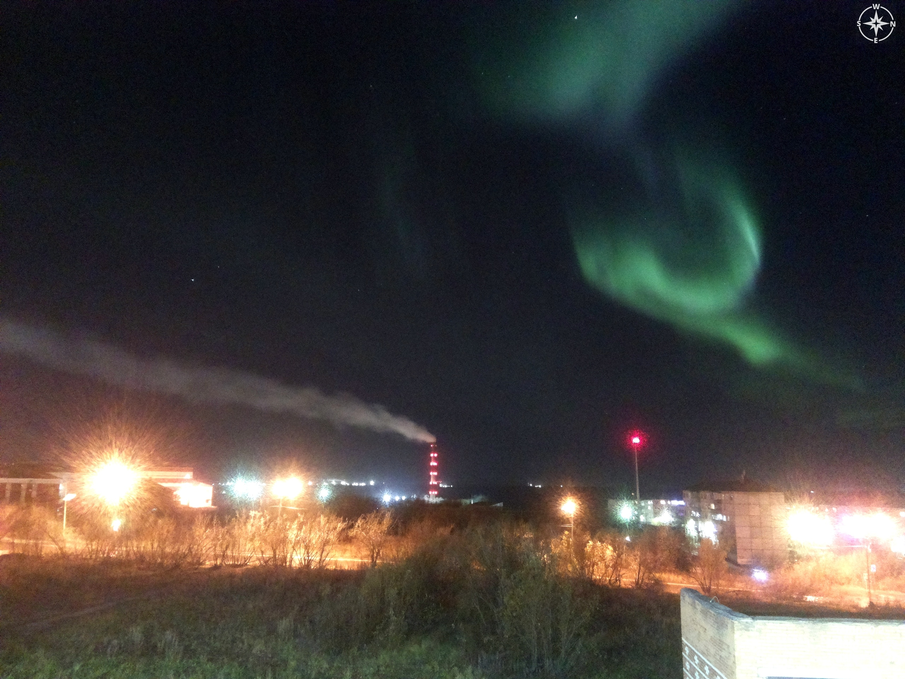
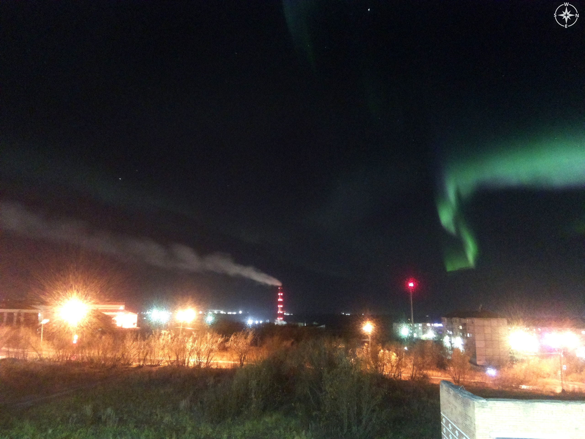
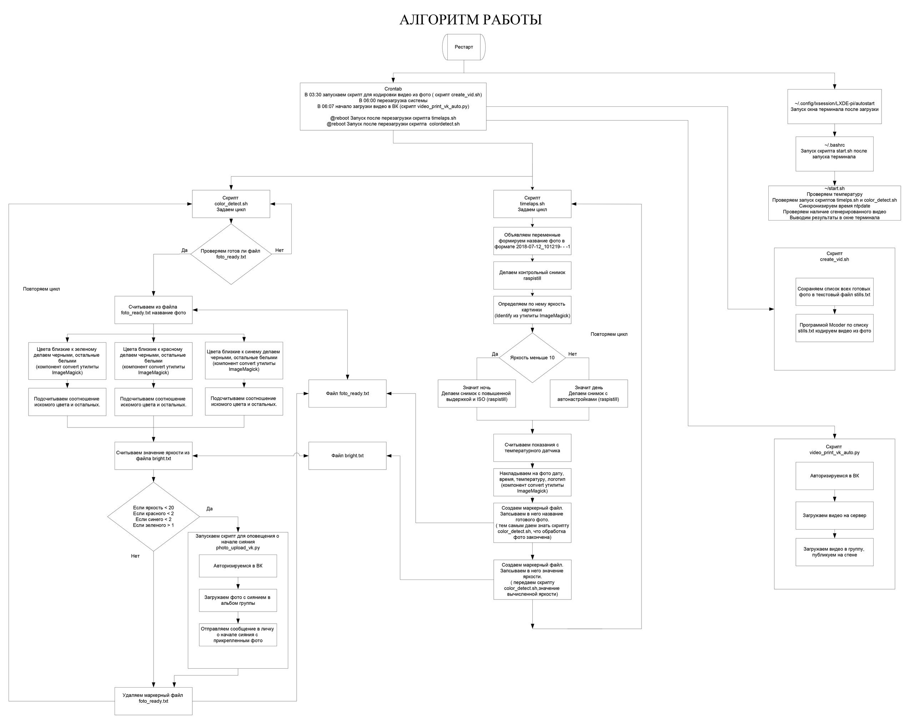

# Детектор полярного сияния 

🌌⏱️ Устройство для автоматической сьемки timelaps, а также определени налиячия полярного сияния. Многофункциональность расширена до автоматической сьемки неба через равные промежутки времени, их склейки в timelaps, закачки на сервер, оповещений и тд.  
Основано на **Raspberry**.  


<p align="center">
  <a href="docs/photos/aurora1.jpg">
    
  </a>
  <a href="docs/photos/aurora3.jpg">
    
  </a>
</p>

---


## ✨ Возможности и особенности
- Фотосъёмка по циклу / времени (raspistill) через равные промежутки.
- Снятие температуры с датчика 1-wire и добавление в подпись. (timelaps.sh, temp.sh).
- Добавление водяного знака и текста (дата, время, температура) с помощью ImageMagick. (см. timelaps.sh).
- Генерация видео timelaps из полученных снимков (mencoder в текущей реализации). (create_vid.sh). 
- Автозагрузка видео в ВКонтакте через VK API (python). (video_print_vk_auto.py).  
- Авто-анализ цвета для детекции полярного сияния (ImageMagick + bash). (color_detect.sh, color.sh).
- Автоматическая отправка оповещений избранному списку пользователей email о начале сияния.

---

## 📂 Структура репозитория
```lora-dx/
├── README.md # Основное описание проекта
├── docs/ # Документация и вспомогательные материалы
│ ├── algoritm.jpg # Схема алгоритма работы 
│ └── photos/ # Скриншоты, примеры фото/кадров
│
├── scripts/ # Основные рабочие скрипты
│ ├── timelaps.sh # Съёмка кадров, watermark, запись маркеров
│ ├── color_detect.sh # Детекция полярного сияния по цветам
│ ├── color.sh # Тестовый скрипт анализа цвета (отладка)
│ ├── create_vid.sh # Сборка timelapse-видео из кадров
│ ├── temp.sh # Чтение температуры и диагностика
│ └── video_print_vk_auto.py # Загрузка timelapse-видео во ВКонтакте
│
├── assets/ # Дополнительные материалы
│ └── watermark.png # Логотип/водяной знак для фото
│
├── LICENSE # Лицензия проекта (например, MIT)
└── .gitignore # Исключения для Git (логи, секреты, временные файлы)
```
---
## 🔢 Алгоритм взаимодействия различных частей программы 
<p align="center">
  <a href="docs/algoritm.jpg">
    
  </a>
</p>

## Принцип работы

### Старт (инициализация)
- При старте Raspberry Pi загружается `autostart.sh`, который:
  - в **03:30** запускает `crontab` для очистки папки со старыми кадрами и логами;
  - в **05:00** запускает `timelaps.sh`;
  - параллельно запускает `color_detect.sh`.
- Таким образом, расписание и автоматический старт обеспечены через **cron** и автозагрузку LXDE.

---

### Цикл съёмки (`timelaps.sh`)
Каждая итерация цикла:
1. Формирует имя файла вида `YYYY-mm-dd_HHMMSS---k`.
2. Делает контрольный снимок.
3. С помощью `identify` (ImageMagick) вычисляет яркость кадра.
   - Если яркость `< 10` → ночная съёмка (ISO, длинная выдержка).
   - Иначе → дневная съёмка.
4. Читает температуру с датчика **1-wire**.
5. На финальное фото накладывает watermark (время, дата, температура, логотип).
6. Создаёт два маркерных файла:
   - `foto_ready.txt` (имя готового кадра);
   - `foto_bright.txt` (значение яркости).

---

### Детектор сияния (`color_detect.sh`)
Работает как отдельный процесс в цикле:
1. Проверяет наличие `foto_ready.txt`.
2. Если файл есть:
   - Берёт имя кадра;
   - Обрабатывает его с помощью ImageMagick (выделение диапазона оттенков зелёного);
   - Сравнивает соотношение чёрных/белых пикселей;
   - Учитывает яркость из `foto_bright.txt`.
3. Если процент целевых пикселей превышает порог:
   - Сохраняет копию кадра в папке `color_detect/`;
   - Записывает событие в `detect.txt`;
   - (Опционально) отправляет email-уведомление.
4. Удаляет `foto_ready.txt`, чтобы ждать следующий снимок.

---

### Сборка timelapse (`create_vid.sh`)
- Запускается по расписанию (например, раз в сутки).
- Собирает список всех JPG-кадров.
- Кодирует видео (`mencoder` → AVI).
- Перемещает готовое видео в `time_video/`.
- Удаляет исходные кадры (**риск гонки с `timelaps.sh`**).
- Создаёт маркер `marker_file`.

---

### Загрузка видео (`video_print_vk_auto.py`)
- Использует VK API:
  - вызывает `video.save` → получает `upload_url`;
  - загружает видео;
  - публикует его в группе.
- Запускается автоматически после генерации видео.

---

### Email-уведомления
- При срабатывании детектора (обнаружено сияние) запускается отправка писем с прикреплённым кадром.

---

### Взаимосвязи
- `timelaps.sh` → создаёт `foto_ready.txt` → запускает обработку в `color_detect.sh`.
- `create_vid.sh` работает независимо, но использует те же JPG-кадры из папки `timelaps/`.
- `video_print_vk_auto.py` запускается после `create_vid.sh`.
- Вся система управляется через **cron** и автозапуск.

---
---

## Оборудование

- Raspberry Pi (модель: любое поколение с камерным интерфейсом)
- Камера, совместимая с raspistill
- Датчик температуры (1-wire), например DS18B20 (ваш скрипт читает /sys/bus/w1/devices/10-.../w1_slave).
- Накопитель (SD/USB) для хранения снимков/видео

---
## Зависимости (ПО)

Необходимые пакеты на Raspberry Pi для функционирования устройства:

- raspistill (часть raspicam) — съемка
- imagemagick — обработка изображений (convert, identify). Скрипты активно используют convert и identify.
- mencoder (в текущей реализации используется для сборки видео) или ffmpeg (рекомендую перейти на ffmpeg).
- python3, pip3
- Python: requests (использует video_print_vk_auto.py).
- ntpdate (используется для синхронизации времени в temp.sh). 

Пример установки (Raspbian / Debian):

sudo apt update
sudo apt install -y imagemagick mencoder ffmpeg ntpdate python3-pip
pip3 install requests


## Запуск вручную и автозапуск
### Ручной запуск

Запустить timelapse-съёмку:
```bash
bash scripts/timelaps.sh
```

Запустить демон color-detect (бесконечный цикл, проверяет foto_ready.txt):
```bash
bash scripts/color_detect.sh
```

Сгенерировать видео (ручной запуск скрипта сборки):
```bash
bash scripts/create_vid.sh
```

Загрузить видео в ВК (python-скрипт):
```bash
python3 scripts/video_print_vk_auto.py
```

Что делает timelaps.sh

timelaps.sh — основной цикл съёмки и подготовки кадра для анализа:

1. Генерация имени файла
Формирует имя в формате YYYY-mm-dd_HHMMSS---k.

2. Контрольный снимок
Делается короткий тестовый кадр raspistill для оценки сцены.

3. Оценка яркости
С помощью identify (ImageMagick) считывается значение яркости:

если brightness < 10 → включается ночной режим (увеличенная выдержка, ISO);

иначе → дневной режим (короткая выдержка/стандартные параметры).

4. Чтение температуры
Получение показаний с датчика 1-wire (DS18B20) и форматирование значения.

5. Наложение watermark
С помощью convert (ImageMagick) на финальный кадр накладываются:

логотип / watermark (assets/watermark.png),

подпись с датой и временем,

температура и прочая служебная информация.

6. Создание маркеров для детектора

foto_ready.txt — содержит имя готового файла (триггер для color_detect.sh);

foto_bright.txt — содержит значение яркости (используется при принятии решения).


---
## ⚖️ Лицензия
Проект распространяется под лицензией [MIT](LICENSE).

